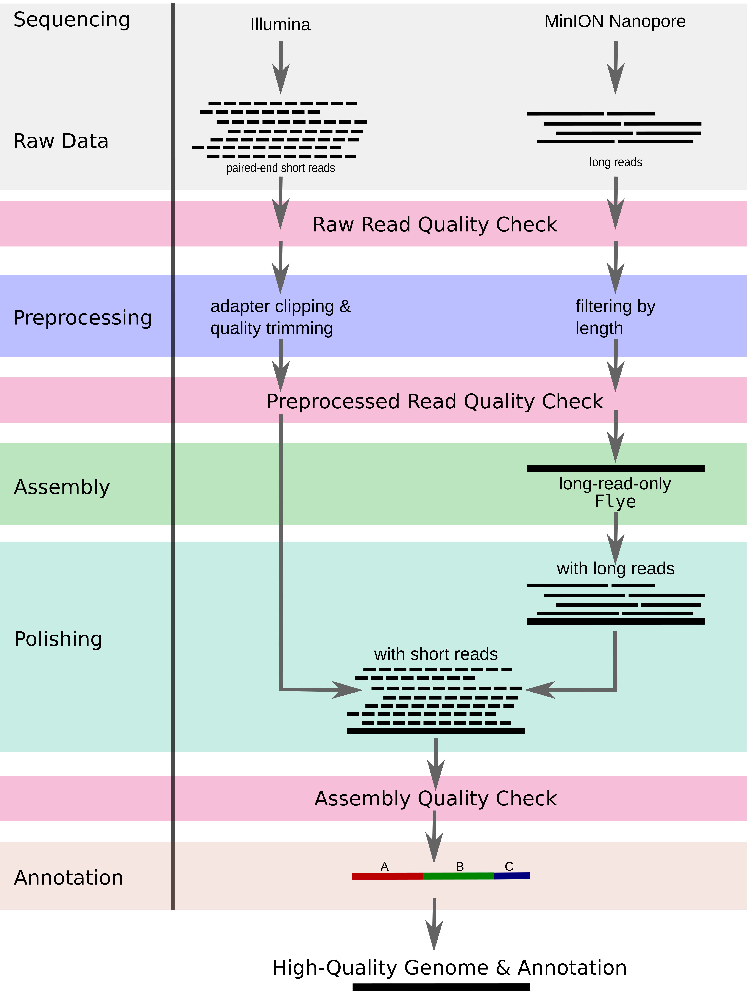

# `Mycovista` - a pipeline to assemble (highly repetitive) bacterial genomes

## Installation
In order to run `Mycovista`, you'll need to install:
* [conda](https://docs.conda.io/en/latest/)
* [snakemake](https://snakemake.readthedocs.io/en/stable/)

## Usage
To use `Mycovista`, edit the `config.yaml` file
* specify the pipeline you want to use: long or hybrid mode
* insert additional information:
  * path to input short reads
  * path to input long reads 
  * path to output folder
  * names of the bacterial strains

*Note: The raw read files must contain the name of the strain in the file name.*

A `python` script helps you to generate all folders required for the output. Just run:

``python scripts/create.py``

Afterwards, all required data should be linked in the `raw_data/` folder. Please check this!

Now you can get started and assemble your bacterias. You can start `Mycovista` by using:

``snakemake -s <mode> -c <#threads> --use-conda``
* `mode - assembly mode file (long or hybrid)`

*Tip: You can use `-n` for a dry run to check if snakemake will start all required rules.*

## Tools
When using `Mycovista`, please cite all incorporated tools as without them this pipeline wouldn't exist.

[FastQC](http://www.bioinformatics.babraham.ac.uk/projects/fastqc/) and [NanoPlot](https://github.com/wdecoster/NanoPlot) are used for quality check of the reads (raw and preprocessed).
Short reads are filtered by [fastp](https://github.com/OpenGene/fastp) for adapter clippling and [Trimmomatic](https://github.com/usadellab/Trimmomatic) for quality trimming.
Long reads are filtered by length using [Filtlong](https://github.com/rrwick/Filtlong).
[Flye](https://github.com/fenderglass/Flye) assembles the long reads first. The assembly is then polished with long reads by [Racon](https://github.com/isovic/racon) using [minimap2](https://github.com/lh3/minimap2) as mapper inbetween. Afterwards, [medaka](https://github.com/nanoporetech/medaka) is incorporated as additional polishing step with long reads. In hybrid mode, the assembly postprocessed further with Racon and minimap2 using short reads.
The final assembly is annotated by [Prokka](https://github.com/tseemann/prokka) and general assembly statistics are calculated by [QUAST](https://github.com/ablab/quast).

Downstream analysis of our *M. bovis* assembly panel included pangenome analsis followed by a genome-wide association analysis (GWAS). We provided the R script for the GWAS in [`scripts/gwas.R`](https://github.com/sandraTriebel/mycovista/blob/master/scripts/gwas.R).

  
Click here for all citations

* fastp
  * ``Chen S, Zhou Y, Chen Y, Gu J (2018) fastp: an ultra-fast all-in-one FASTQ preprocessor. Bioinformatics 34(17):i884–i890``

* Trimmomatic
  * ``Bolger AM, Lohse M, Usadel B (2014) Trimmomatic: a flexible trimmer for Illumina sequence data. Bioinformatics 30(15):2114–2120``

* Filtlong
  * ``Wick R (2018) Filtlong. Available: https://github.com/rrwick/Filtlong``

* Flye
  * ``Kolmogorov M, Yuan J, Lin Y, Pevzner PA (2019) Assembly of long, error-prone reads using repeat graphs. Nature Biotechnology 37(5):540–546``

* Racon
  * ``Vaser R, Sovi ́c I, N N, Šiki ́c M (2017) Fast and accurate de novo genome assembly from long uncorrected reads. Genome Research 27:737–746``

* minimap2
  * ``Li H (2018) Minimap2: pairwise alignment for nucleotide sequences. Bioinformatics 34(18):3094–3100``

* medaka
  * ``Ltd. ONT (2018) medaka: Sequence correction provided by ONT Research. Available: https://github.com/nanoporetech/medaka``

* FastQC
  * ``Andrews S, et al. (2012) FastQC (Babraham Institute. Available: https://www.bioinformatics.babraham.ac.uk/projects/fastqc/``

* NanoPlot
  * ``De Coster W, D’Hert S, Schultz DT, Cruts M, Van Broeckhoven C (2018) NanoPack: visualizing and processing long-read sequencing data. Bioinformatics 34(15):2666–2669``

* QUAST
  * ``Gurevich A, Saveliev V, Vyahhi N, Tesler G (2013) QUAST: quality assessment tool for genome assemblies. Bioinformatics 29(8):1072–1075``

* Prokka
  * ``Seemann T (2014) Prokka: rapid prokaryotic genome annotation. Bioinformatics 30(14):2068–2069``

* R
  * ``R Core Team (2022). R: A language and environment for statistical computing. R Foundation for Statistical Computing, Vienna, Austria. https://www.R-project.org/.``

## Pipeline Overview
